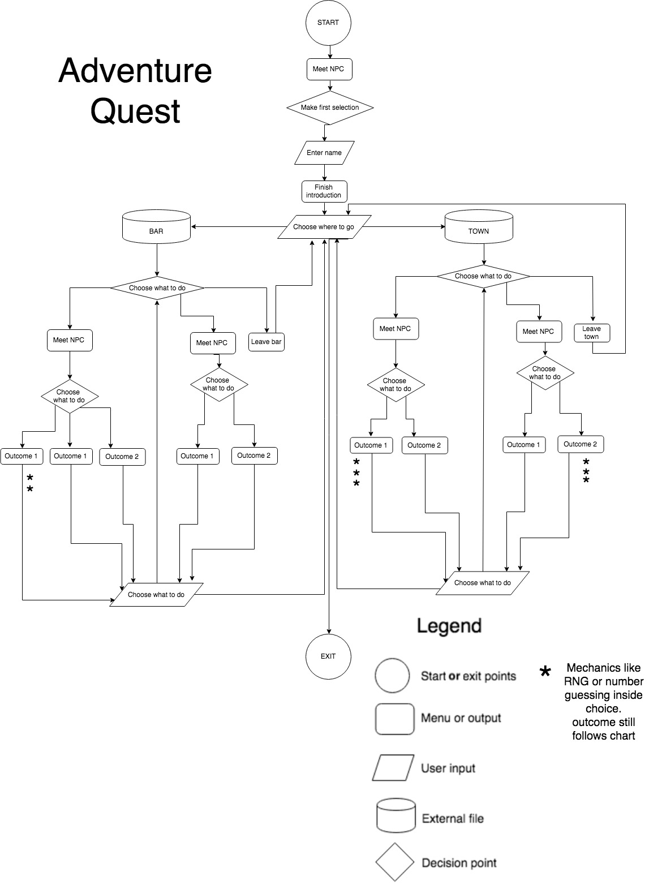

######Student#: CAS021901 
######Name: Cassie Sloan
######Assignment 1: Terminal Application
######Application name: Adventure Quest

##SOFTWARE DEVELOPMENT PLAN

## Statement of purpose

#####What will Adventure Quest do?
Adventure Quest is a quaint and wholesome choose-your-own-adventure game written in Ruby and designed to run through a computer’s terminal. It has a wide variety of choices and mechanisms for the user to shape their journey with and a plethora of colourful dialogue to guide the user through the game. 

Each decision the user makes has a unique outcome. All of the seperate adventures lead you back to the 'main street' where you began so that you may exit or explore another area. Adventure Quest also includes some 'mini-games' that work with random number generation and user input.

###

#####What problem does Adventure Quest solve?
While it may not solve world hunger or help you quit smoking (I mean, it may if you’re distracted for long enough!) Adventure Quest aims to remedy boredom and entertain users with a small yet rich world to explore in a style not dissimilar to a visual novel. Users might play Adventure Quest for the same reasons they might pick up a book or listen to a podcast – for entertainment! It is being developed for this reason.

###

#####Target Audience
Adventure Quest is suitable for all ages! The dialogue is simple and the themes are appropriate for everyone.

###
	
#####How will it be used?	
As mentioned above, users in the target audience will use this for entertainment value. Maybe they’re 		waiting for a friend in a cafe, or trying to kill some time before school starts – the purpose is for fun!

## Features

#####1. Luck-based mini games
Adventure quest uses RNG (random number generation) as a mechanic in some of the mini games. An example of this might be when you're in the *town* and you want to get your fortune told – Ruby generates a random number (between 1 and 10) when the user hits 'enter', and depending on the outcome, it will return one of a variety of options. The method I used for this was:

    random_number = rand 10 
         puts random_number
         case random_number
         when 0..3 
            puts "dialogue 1"
         when 4..7
            puts "dialogue 2"
         when 8..10
            puts "dialogue 3"
         end
                        
This way, you can play the game over and over and receive different outcomes.
#####2. Guessing mini-games
Another mechanic used in Adventure Quest is guessing games. An example of this would be in the *bar* when Princess Ascii asks you to guess what number she's thinking of (between 1 and 9). Her number is randomly generated each time the mini-game is initiated, and the user wins when they guess correctly. The method I used for this was:

    princess_number = rand 10 
    guess = gets.chomp.to_i
        if guess == 0
            puts "Guess 1-9, genius!" 
        elsif guess == princess_number
          puts "dialogue win"   
        elsif guess != princess_number
            puts "dialogue lose"
        end
Again, this adds to the replay value as the princess's number will change each time.        
#####3. Visually interesting
I wanted to bring the game to life in an interesting, yet retro kind of way – being confined to the limitations of running through the terminal, I decided to incooperate Ascii art into Adventure Quest. I sourced a variety of silly looking people to stand in for characters and formatted signs for each area to make the experience more immersive and authentic. 

##User experience

Users will be guided through the story with the use of other characters in the game (NPCs). Their dialogue provides opportunities for the user to make a choice and change the direction of their journey. The role of Greg in the introduction aids the user in establishing their name and how to progress through the game (by pressing enter), like a tutorial of sorts.

The users interact with the game by selecting the number of the option they would like to choose and pressing enter. Should the user not understand this and press any other key than the accepted input, a message displays saying: “Hey genius, press 1, 2 or 3!” to handle any user error. Other ways of interacting with the game include pressing enter when a RNG will establish a ‘roll’ and choosing a number between 1-9 to achieve outcomes. Similar error messages display for these respective functions.

##Control flow

##Implementation plan

Tuesday | Wednesday | Thursday | Friday
------------ | ------------- | ------------- |-------------
Draft control flow chart  | Assess scope of required documentation | Continue writing program | friday| 
Establish decisions made by user and outcomes achieved | Finalise control flow chart | Ensure DRY principles are being used 
Research how to register just the ‘Enter/Return’ key as input | Draft Software Development Plan | Design help/read/me file
Begin scripting dialogue | Research RNG for game mechanic | Logistics for bash script and formatting in directories
Research and utilise Ascii elements for aesthetic purposes| Find 3 more gems to use in application - music?? |ss | ss
Begin writing foundational code | 

- [Trello board](https://trello.com/invite/b/Swkg7k70/2ca3401b6708375857aa3b2bbfd77226/terminal-application-i)

- [Version control with git/github](https://github.com/CassieSloan/Adventure_quest)

- [Error testing]()

help
bash.sh 
gems
rb files
and packaging